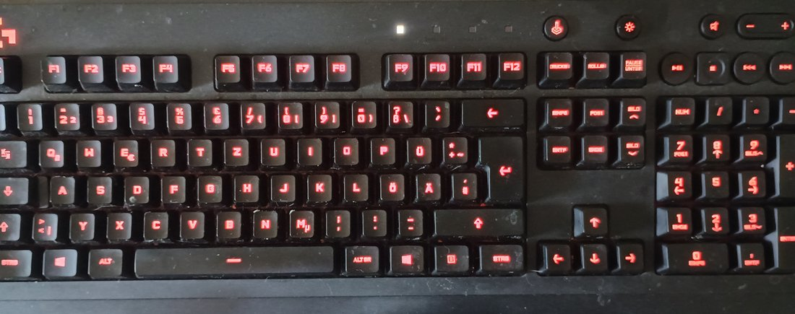

# G213Tray

A lightweight KDE system tray applet to control the backlight color of Logitech G213 and G512 gaming keyboards. This fork builds on the original project with a more complete feature set, better keyboard support, and a more polished KDE tray experience.


## Enhancements over the original App

This fork improves the original G213Tray in several practical ways:

- Adds support for both the Logitech G213 and the Logitech G512
- Adds per-key RGB control and key-group presets for G512 users
- Adds a custom color editor with saveable presets and local reuse
- Detects the connected keyboard automatically and keeps a manual override option
- Supports both English and German interface text with automatic locale detection
- Remembers the last on/off state and color across reboots
- Adds KDE autostart defaults and a cleaner tray-menu workflow
- Keeps setup simple with a one-time udev rule and no Logitech software required

The result is a more complete, user-friendly fork that keeps the original idea but makes the app much more flexible and convenient for daily use.

## Visuals



## Features

- **Toggle lighting** with a single left-click on the tray icon
- **7 color presets** (White, Red, Green, Blue, Purple, Orange, Cyan)
- **Custom color picker** for any RGB color
- **Per-key RGB control** on the Logitech G512
- **Key-group presets** for WASD, arrows, function keys, navigation, modifiers, and numpad
- **Remembers** last color and on/off state across reboots
- **Keyboard selector** for Logitech G213 and G512 protocol profiles
- **Language selector** for German and English interface text
- **Automatic startup defaults** based on the connected keyboard and system language
- **Autostart** via KDE's standard autostart mechanism
- No root required after a one-time udev rule setup

## Compatible keyboards

Tested and confirmed working. By default, the keyboard profile is detected from the connected USB device and the interface follows the system language. Manual choices remain available from the tray menu under **Keyboard** and **Language**:

| Keyboard | Vendor ID | Product ID |
|---|---|---|
| Logitech G213 Prodigy | `046d` | `c336` |
| Logitech G512 | `046d` | `c342` or `c33c` |

Other Logitech G-series keyboards that use the same HID protocol **may** work by adding their product ID to `PRODUCT_IDS` in `g213tray.py`. Check yours with:

```bash
lsusb | grep Logitech
```

> **Not supported** by `libratbag`/`piper` — this tool communicates directly with the selected keyboard via USB HID, which is why it works where other tools don't.

## Requirements

- Python 3.8+
- PyQt6
- pyusb

```bash
# openSUSE / Tumbleweed
sudo zypper install python3-PyQt6 python3-pyusb

# Fedora
sudo dnf install python3-pyqt6 python3-pyusb

# Ubuntu / Debian
sudo apt install python3-pyqt6 python3-usb
```

## Installation

### 1. Clone the repository

```bash
git clone https://github.com/Agundur-KDE/G213Tray.git
cd G213Tray
```

### 2. Install the udev rule

This allows your user to access the keyboard's USB interface without `sudo`:

```bash
sudo cp 99-g213.rules /etc/udev/rules.d/
sudo udevadm control --reload-rules
sudo udevadm trigger --subsystem-match=usb
```

You only need to do this once. The rule persists across reboots.

### 3. Make the script executable

```bash
chmod +x g213tray.py
```

### 4. Test it

```bash
python3 g213tray.py
```

A keyboard icon should appear in your KDE system tray. Left-click toggles the light, right-click opens the color menu.

On the G512, open **Custom color** to open the editor. Select individual keys, use **Select all**, or choose a group, then choose a color and press **Apply**. **Save preset** stores the selected keys and their colors locally for reuse; saved presets appear immediately in the vertical preset list and can be removed with the red **X** button. **Cancel** discards dialog changes, while **OK** applies them and closes the editor. The G213 supports whole-keyboard and region lighting only because its USB protocol does not provide individual-key addressing.

### 5. Enable autostart

To start G213Tray automatically when you log in to KDE:

```bash
cp g213tray.desktop ~/.config/autostart/
```

Edit the `Exec=` line in the `.desktop` file to point at the full path of `g213tray.py` inside wherever you cloned the repo, e.g. `/home/<user>/G213Tray/g213tray.py`.

## Usage

| Action | Result |
|---|---|
| Left-click the tray icon | Toggle lighting on/off |
| Right-click → color name | Apply a preset color |
| Right-click → **Saved presets** → preset name | Apply a saved preset directly |
| Right-click → *Custom color…* | Open the color picker |
| Right-click → *Quit* | Exit the applet |

The selected color and on/off state are saved to `~/.config/g213tray.json` and restored on the next start.

## How it works

The G213 exposes a USB HID interface that accepts proprietary control packets on interface 1. G213Tray sends a 20-byte color command directly via `pyusb`:

```
11 ff 0c 3a 00 01 [R] [G] [B] 00 00 00 00 00 00 00 00 00 00 00
```

`libratbag` / `piper` do not support the G213, so this tool talks to the hardware directly.

## License

GPL-3.0-or-later
